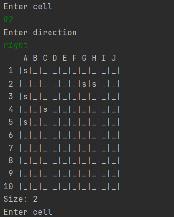

###How to arrange ships?
- You can choose automatic mode, then the program will arrange the ships by itsel. To select this option enter **_auto_**

  
- Нou can choose manual mode to arrange the ships yourself. To select this option enter **_manual_**
  

The **_Size_** parameter indicates the size of the ship. To select a cell, just enter its coordinates.
When you get to the double-decked and large ships, you will need to enter not only the cell, but also the direction of the ship's placement

There are 4 directions:
* right
* left
* up
* down

For example, if you want a two-deck ship to stand in G2 and H2, you need to enter the following command

